# Installation

## User creation and configuration
First of all we have to create a user account for the robot. This can be done by running the web or the app application. Once we open the app, we can create a new user by clicking on the register button, these will show you the form to fill in. The form will ask you to fill in the following information:

* Username
* Password
* Email
* Confirm password


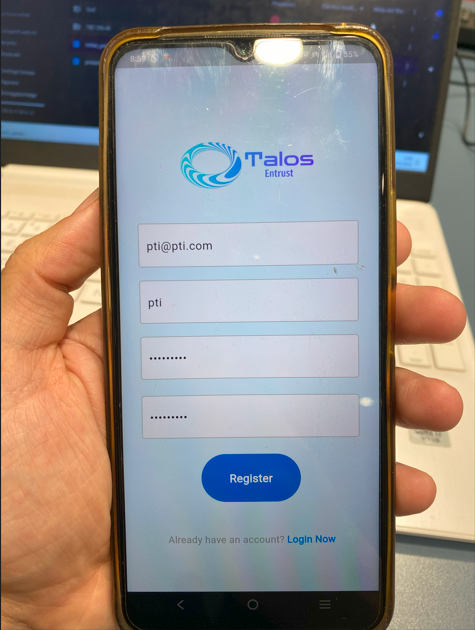{: style="height:500px;width:400px"}

Once we have filled in the form we can click on the "Register" button. This will create a new user account.
Then, we can go to the login page and login with the user we just created.

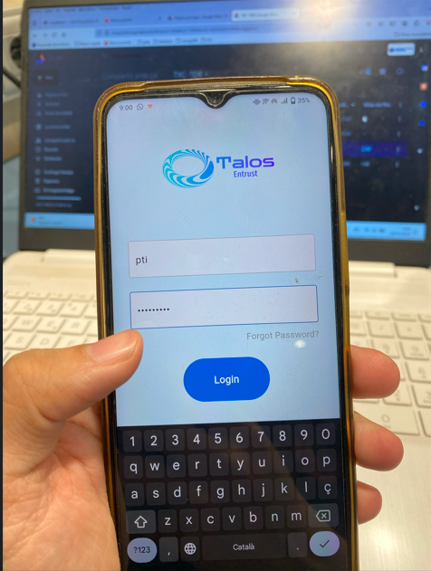{: style="height:500px;width:400px"}

Once you have logged in you should be seeing the home page empty.

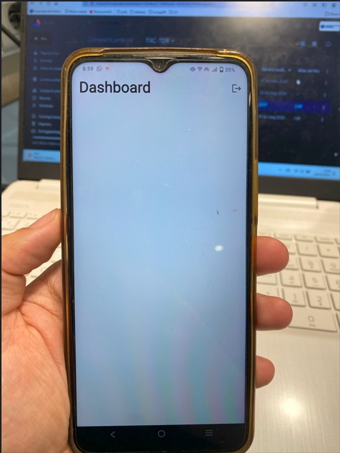{: style="height:500px;width:400px"}

With this we acomplished an update to the database. We can see more in depth the information stored in the database in the following image:

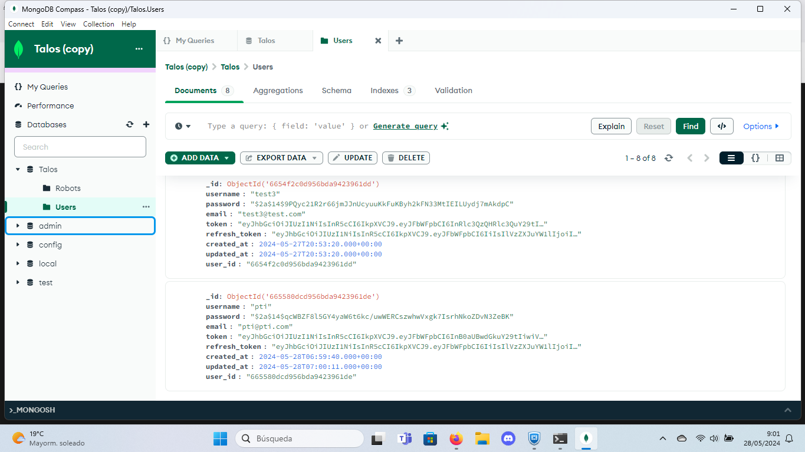{: style="height:500px;width:800px"}

## Robot creation and configuration
To begin the robot creation we will need the following components:

- A user account (which we already have)
- HDMI wire
- Screen
- Mouse 
- LicheePi

Then, you will have to plug the robot to the power source and connect the HDMI wire to the screen and the robot.
Once the system has booted up, you will need to configure the wifi network. This is done by going to the wifi tab in the settings menu at the top of the screen and inserting the SSID and password of the network you want to connect to. Once you have done this, you should have internet access.

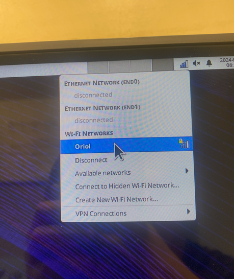{: style="height:500px;width:400px"}

Once you have done this, you can head to the following link: [http://talos.com:8080](http://talos.com:8080)

**WARNING: This web is only accessible in the robot. Do not try to access it from your computer**

This will show you a form to fill in. The form will ask you to fill in the following information:

- Username
- Password
- Robot name

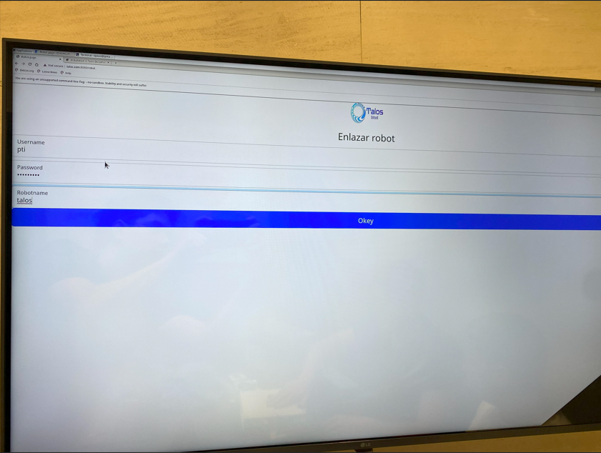{: style="height:500px;width:800px"}

And then we have to click on the "Okey" button. Then we will be redirected to the robot configuration page. This page will show you a google maps form to select the route that the robot will follow. In that page we have to select the exact location in the google maps where we want the robot to go. The robot will then follow this route and will walk through each location.

To tell the robot to follow a specific route, we have to click on the map and a Marker will appear. Those Markers are the waypoints that the robot will follow. Once you have selected the route you want, you can click on the "Store All Markers" button.

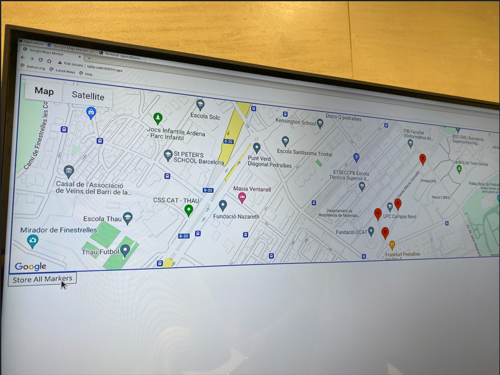{: style="height:500px;width:800px"}

Finally, we have completed all the configuration of the robot. If you encounter any problem, you can contact us at [contacto@talos.com](mailto:contacto@talos.com).
If everything went well, you should be able to see the following page:

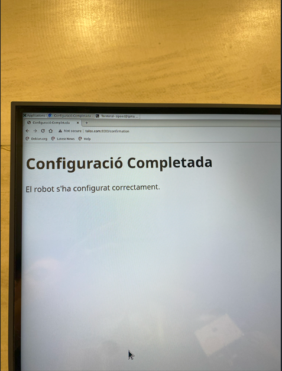{: style="height:500px;width:400px"}

And also, you should be able to see the robot information in the database:

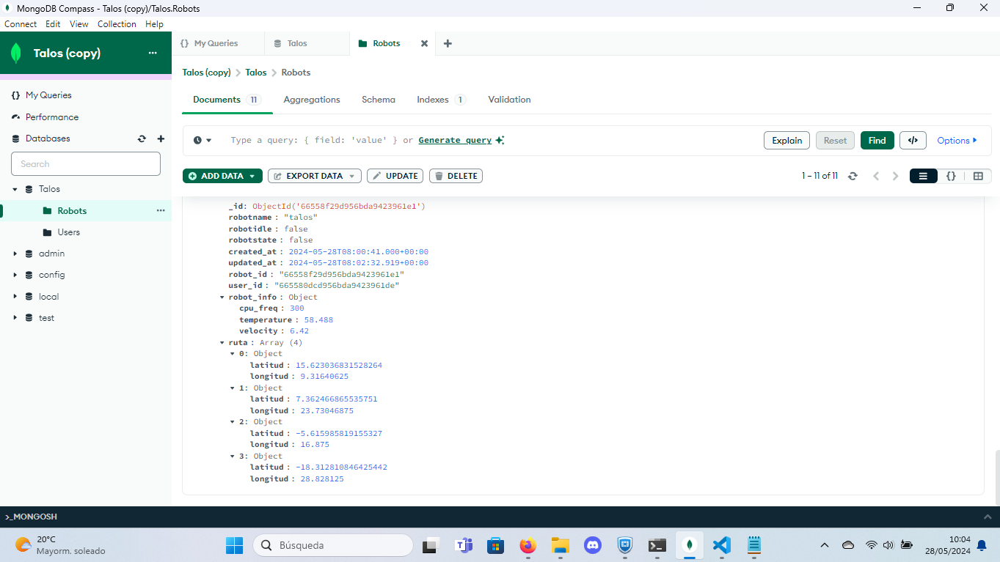{: style="height:500px;width:900px"}

## Additional Configuration

### Videostreaming
If we want to enable the videostreaming of the robot, we have to execute the following command:

```bash
python3 /home/sipeed/Projects/Streaming/script.py
```

We recommend you to use a screen to execute this command. To do this, you can use the following command:

```bash
screen -S streaming
```

## Final steps

Once you have completed the configuration of the robot, you can view every configuration of the robot in the webpage and also the mobile application. But for this installation guide we will use the mobile application to view the robot configuration.

Now the robot dashboard should no longer be empty and will have the robot you have just created. It should look like this:

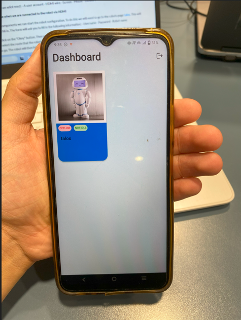{: style="height:400px;width:400px"}

Then, to see more in depth the information of the robot, we can click on the robot name and we will see the following page that will contain:

- The robot name
- The creation date
- The modification date

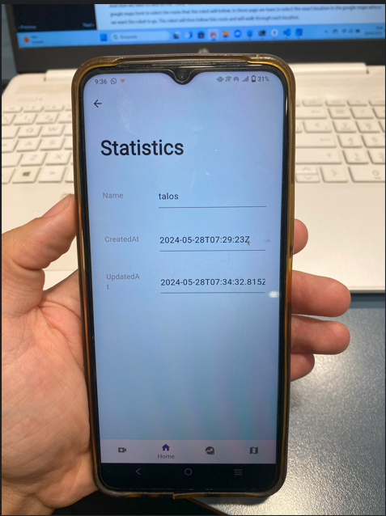{: style="height:500px;width:400px"}

Now we can navigate with the bottom navigation bar to all the different pages of the robot.
First of all, we will navigate to the "Macros" page. This page will contain the specific information of the robot. In this page we can see the following information:

- Temperature of the CPU
- Frequency of the CPU

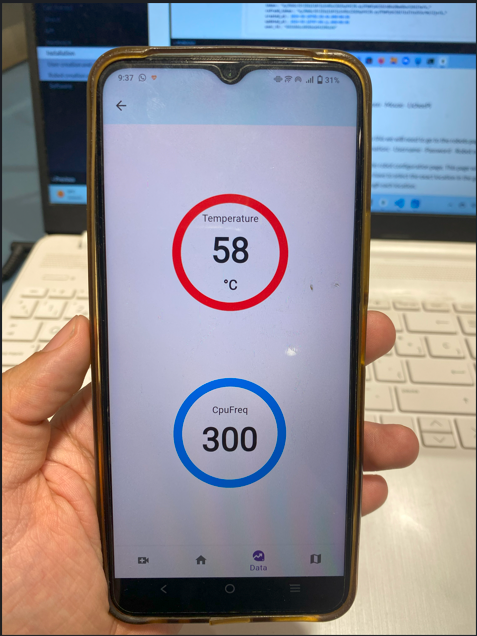{: style="height:500px;width:400px"}

Then, we can navigate to the "Map" page. This page will show you the map of the robot. Specifically, it will show the markers you just created in the configuration of the robot and it represents the waypoints that the robot will follow.

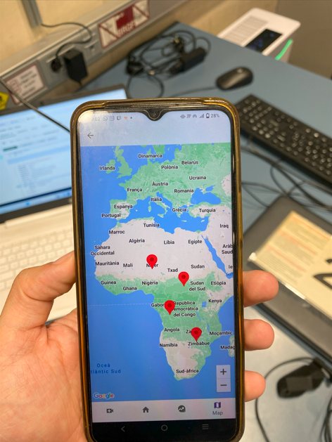{: style="height:500px;width:400px"}

Finally, we can navigate to the "VideoStreaming" page and we will see the video stream of the robot.

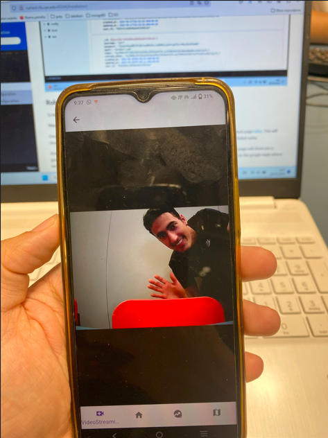{: style="height:500px;width:400px"}

And that's it! You have completed the installation of the robot. If you encounter any problem, you can contact us at [contacto@talos.com](mailto:contacto@talos.com).
